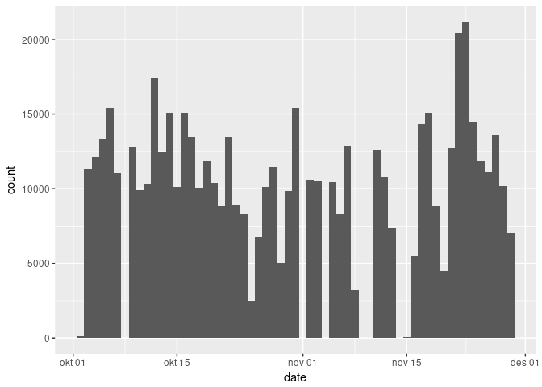
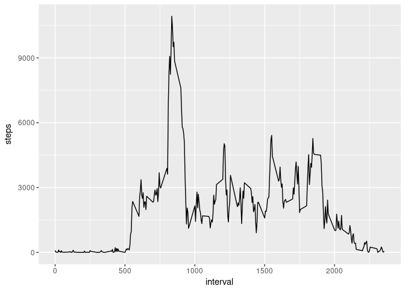
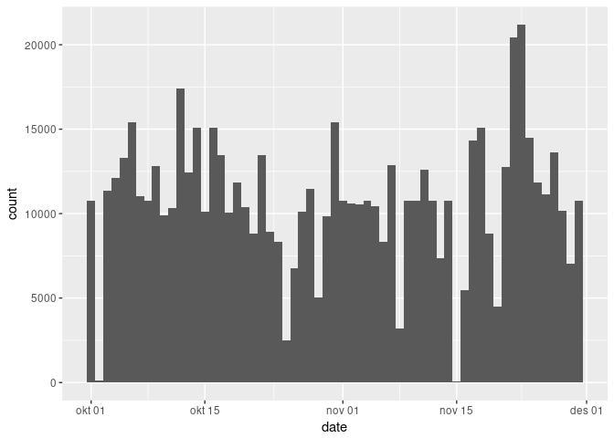
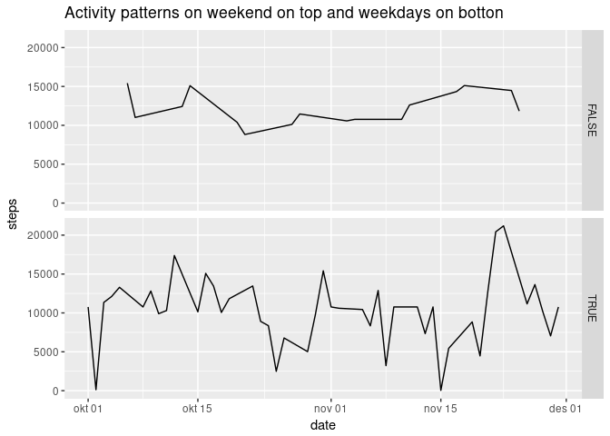

# Reproducible Research: Peer Assessment 1


## Loading and preprocessing the data

```r
activity <- read.csv("activity.csv")
activity$date <- as.Date(as.character(activity$date))
```

## What is mean total number of steps taken per day?

```r
library(ggplot2)
stepsbydate <- aggregate( steps ~ date, data=activity, FUN=sum)
ggplot(stepsbydate,aes(x=date, weight=steps)) + geom_histogram(binwidth = 1)
```

<!-- -->

```r
summary(stepsbydate$steps)
```

```
##    Min. 1st Qu.  Median    Mean 3rd Qu.    Max. 
##      41    8841   10765   10766   13294   21194
```


## What is the average daily activity pattern?

```r
stepsbyinterval <- aggregate( steps ~ interval, data=activity, FUN=sum)
ggplot(stepsbyinterval,aes(x=interval, y=steps)) + geom_line()
```

<!-- -->

```r
stepsbyinterval[stepsbyinterval$steps==max(stepsbyinterval$steps),]
```

```
##     interval steps
## 104      835 10927
```


## Imputing missing values

```r
mean(!complete.cases(activity))
```

```
## [1] 0.1311475
```

```r
library(plyr)
impute.mean <- function(x) {
  replace(x, is.na(x), mean(x, na.rm = TRUE))
}
activity2 <- ddply(activity, ~ interval, transform, steps = impute.mean(steps))

library(ggplot2)
stepsbydate2 <- aggregate( steps ~ date, data=activity2, FUN=sum)
ggplot(data=stepsbydate2,aes(x=date, weight=steps)) + geom_histogram(binwidth = 1) #+ geom_histogram(data=stepsbydate,aes(x=date, weight=steps), binwidth = 1, fill="blue", alpha=0.2)
```

<!-- -->

```r
summary(stepsbydate2$steps)
```

```
##    Min. 1st Qu.  Median    Mean 3rd Qu.    Max. 
##      41    9819   10766   10766   12811   21194
```


## Are there differences in activity patterns between weekdays and weekends?

```r
library(ggplot2)
library(lubridate)
```

```
## 
## Attaching package: 'lubridate'
```

```
## The following object is masked from 'package:plyr':
## 
##     here
```

```
## The following object is masked from 'package:base':
## 
##     date
```

```r
stepsbydate2$wday <- wday(stepsbydate2$date) %in% c(2,3,4,5, 6)
ggplot(stepsbydate2, aes(x=date, y=steps)) + facet_grid(facets = wday ~ .) + geom_line() + ggtitle(label = "Activity patterns on weekend on top and weekdays on botton")
```

<!-- -->

```r
#+ geom_histogram(data=stepsbydate,aes(x=date, weight=steps), binwidth = 1, fill="blue", alpha=0.2)
summary(stepsbydate2$steps)
```

```
##    Min. 1st Qu.  Median    Mean 3rd Qu.    Max. 
##      41    9819   10766   10766   12811   21194
```
